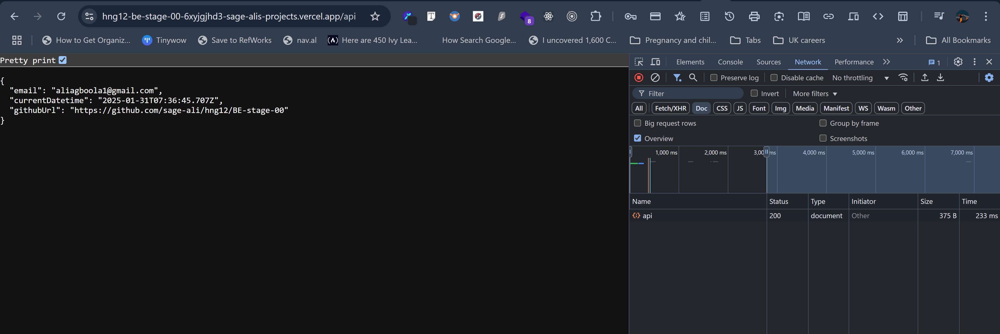

# Stage 0: Getting Started - Basic API

## Task Description

A basic API built with Express and TypeScript.

## Implementation

The implementation involves setting up an Express server with TypeScript and using Vite for the build and development process. The project structure is organized as follows:

1. **Configuration**: The `vite.config.ts` file is used to configure Vite with the `vite-plugin-node` plugin to work with Express. This setup allows for a fast and optimized build process.

2. **Utilities**: A utility function `getCurrentDateTime` is defined in `src/utils/datetime.ts` to get the current date and time in ISO format.

3. **API Routes**: The API routes are defined in `src/routes/api.ts`. The main route `/api` returns an object containing the email, current date and time, and the GitHub URL of the project's codebase.

4. **Server Setup**: The Express server is set up in `src/index.ts`. It includes middleware for CORS and JSON parsing, and defines the root route and the `/api` route.

5. **Deployment**: The application can be built for production using Vite and started using the compiled JavaScript files. The deployment instructions are provided in the README.

## Setup and Running

1. Install dependencies:

   ```bash
   npm install
   ```

2. Run development server:

   ```bash
   npm run dev
   ```

3. Run tests:

   ```bash
   npm test
   ```

4. Build for production:

   ```bash
   npm run build
   ```

5. Start production server:

   ```bash
   npm start
   ```

## Available Scripts

- `start`: Start the production server
- `build`: Compile TypeScript to JavaScript and bundle with vite
- `dev`: Start the development server with vite
- `test`: Run tests with Jest
- `lint`: Run ESLint
- `prettier`: Run Prettier

## API Documentation

This project provides a public API that returns a JSON response with the following details:

- My registered email address.
- The current datetime in ISO 8601 format (UTC).
- The GitHub URL of the project's codebase.

### Endpoint URL

`GET https://hng12-be-stage-00-6xyjgjhd3-sage-alis-projects.vercel.app/api`

---

### Request Format

This endpoint accepts a `GET` request and does not require any request body or parameters.

### Response Format

A JSON object containing the following keys:

- `email`: Your registered email address.
- `currentDatetime`: The current datetime in ISO 8601 format (UTC).
- `githubUrl`: The GitHub URL of the project's codebase.

Example Response:

```json
{
  "email": "aliagboola1@gmail.com",
  "currentDatetime": "2025-01-31T22:27:06.434Z",
  "githubUrl": "https://github.com/sage-ali/hng12/BE-stage-00"
}
```

---

### Example Usage

#### Using `curl`:

```bash
curl https://hng12-be-stage-00-6xyjgjhd3-sage-alis-projects.vercel.app/api
```

#### Response:

```json
{
  "email": "aliagboola1@gmail.com",
  "currentDatetime": "2025-01-31T22:27:06.434Z",
  "githubUrl": "https://github.com/sage-ali/hng12/BE-stage-00"
}
```

---

If you're interested in hiring developers proficient in specific programming languages or stacks, check out the following resources:

- [Hire Python Developers](https://hng.tech/hire/python-developers)
- [Hire C# Developers](https://hng.tech/hire/csharp-developers)

---

## Technologies Used

- Node.js
- TypeScript
- Express
- Jest for testing
- Vite for build and development
- [Other technologies]

## Deployment

Application was deployed to vercel following [this tutorial](https://www.youtube.com/watch?v=CNJkX9rYI8U)

[Link to API](https://hng12-be-stage-00-6xyjgjhd3-sage-alis-projects.vercel.app/api)

To deploy the application locally, follow these steps:

1. Build the application for production:

   ```bash
   npm run build
   ```

2. Start the production server:

   ```bash
   npm start
   ```

3. Ensure your server is configured to serve the built files from the `dist` directory.

---

## Screenshots/Demo


